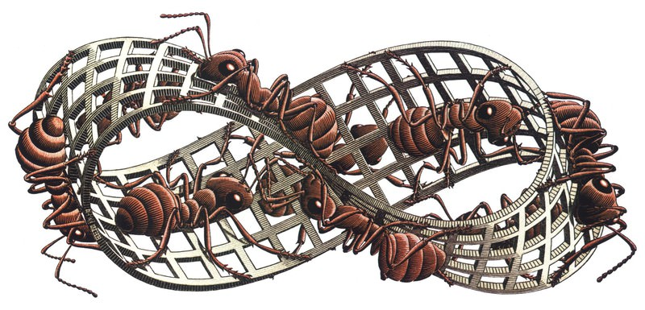

# Ants
:source-highlighter: pygments
:pygments-style: pastie
:icons: font
:experimental:
:figure-caption!:

.Source https://i.imgur.com/R2eAvWi.jpg

{nbsp}

Zagadnienie polegało w oryginale na napisaniu prostego programu pracującego w
terminalu, który rysuje planszę po której chodzą losowo mrówki. Mrówka zajmuje
jedno pole i przesuwa się o jedno pole w dowolnym kierunku. Gdy dochodzi do
krawędzi, pojawia się po drugiej stronie. Program uruchamia się podając wymiary
planszy i liczbę mrówek (można przyjąć jakieś sensowne domyślne wartości lub
wyjąć rozmiar terminala ze zmiennych środowiskowych).

Pierwszy program robi dokładnie to; drugi dodatkowo zapisuje plik _mru.dat_ w
którym w każdym kroku podany jest czas oraz liczba mrówek, a mrówki wyświetlane
są za pomocą kodu ANSI na zielono.

* http://www.cleveralgorithms.com/nature-inspired/index.html[Clever Algorithms: Nature-Inspired Programming Recipes]
** http://www.cleveralgorithms.com/nature-inspired/swarm.html[Swarm Algorithms]
*** http://www.cleveralgorithms.com/nature-inspired/swarm/ant_system.html[Ant System]
*** http://www.cleveralgorithms.com/nature-inspired/swarm/ant_colony_system.html[Ant Colony System]
