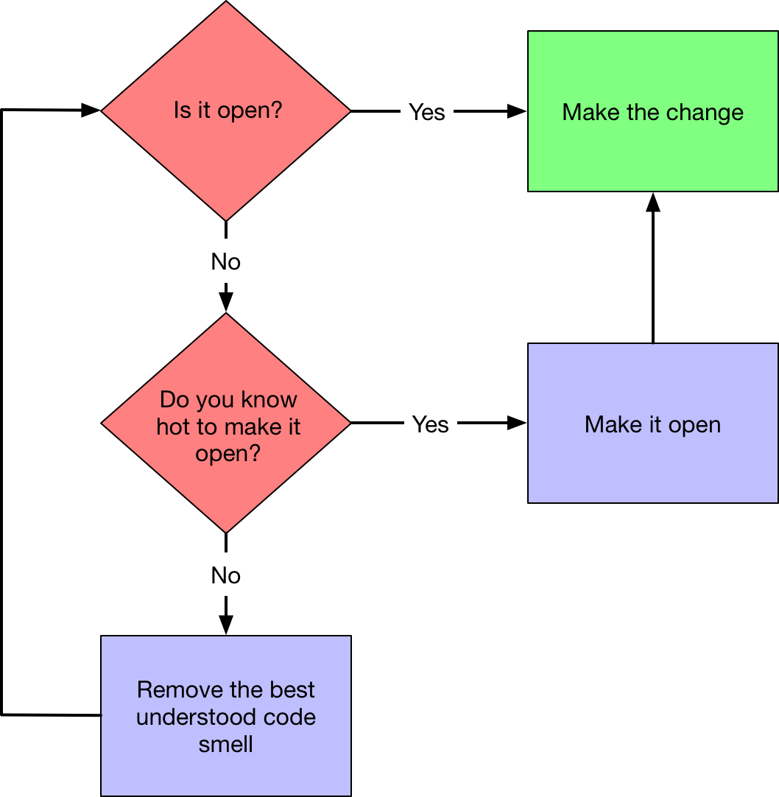

# https://en.wikipedia.org/wiki/Open/closed_principle[Open/Closed Principle] – egzamin z ZJP
:source-highlighter: pygments
:pygments-style: pastie
:icons: font
:experimental:
:figure-caption!:

Kilka odsyłaczy do łatwych przykładów (za prostych na egzamin).

* Jordan Hudgens,
  https://www.crondose.com/2016/08/solid-development-open-closed-principle[SOLID Development: Open Closed Principle Guide and Example]
* Robert C. Martin,
  https://8thlight.com/blog/uncle-bob/2014/05/12/TheOpenClosedPrinciple.html[The Open Closed Principle]
* Sergii Makagon,
  http://rubyblog.pro/2017/05/solid-open-closed-principle-by-example[S[O\]LID - Open/Closed Principle by example]

## :memo: Terminy rozliczenia się z projektu Open/Closed

Terminy prezentacji:

* stacjonarne: 9, 16, 23 stycznia 2018, g. 16:00, aula 1.
* niestacjonarne: 14, 21, 28 stycznia 2018.

Repozytorium z projektem należy podłączyć do
https://classroom.github.com/classrooms[GitHub Classroom].
_Invitation Link_ dostępny u prowadzących.

* Prace oddane po 7.01.2018 – ocena obniżona.
* Prace oddane po 14.01.2018 – ocena ndst z egzaminu w pierwszym terminie.

## Wymagania (projekt zespołowy, maks. 4 programistów)

W repozytoriach należy umieścić:

. w katalogu głównym plik _README_ w którym:
.. opisano proponowane rozszerzenie funkcji programu (biblioteki)
.. w szczegółach opisano zapachy w kodzie i wykonane refaktoryzacje,
   które doprowadziły do zamierzonej otwartości w kodzie
.. w szczegółach opisano proces za pomocą którego zaimplementowano
   proponowane rozszerzenie
.. wstawiono plakietkę (_badge_) do https://travis-ci.org[Travis CI];
  https://docs.travis-ci.com[dokumentacja]
. plik  _Gemfile_ z listą użytych gemów
. w katalogu _lib_ kod w Ruby
. w katalogu _spec_ testy RSpec; albo w katalogu _test_ testy MiniSpec

Przykładowe programy i propozycje zmian można znależć w katalogach
link:RinR[RinR] i link:AntColony[:ant:].

Przykład kodu do refaktoryzacji:

. https://github.com/andersondias/conway-game-of-life-ruby[Conway's Game of Life];
  change – użyć biblioteki https://github.com/ruby/curses[Curses]. Zobacz też
  https://github.com/mmozuras/life[mmozuras].

## JTZ?

Aby uzyskać zamierzoną otwartość w kodzie kierujemy się tym schematem blokowym.

.Source: 99 Bottles of OOP by S. Metz & K. Owen

